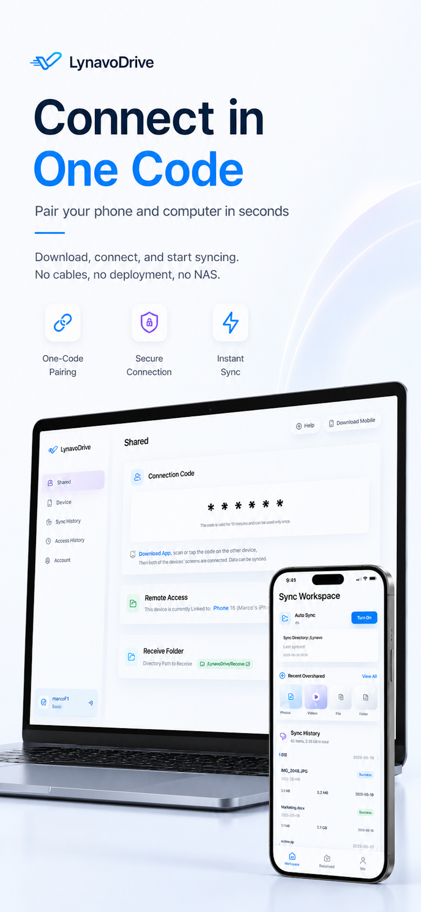
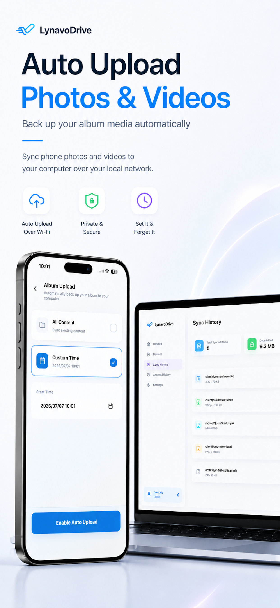
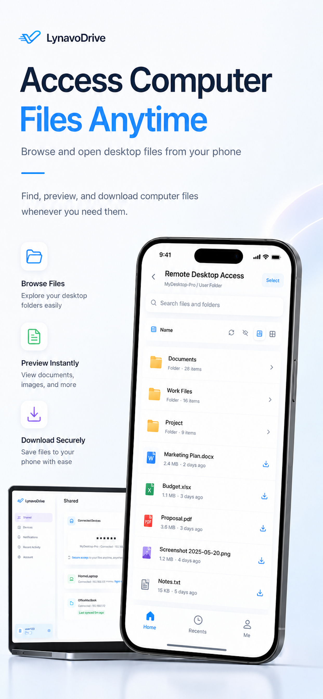
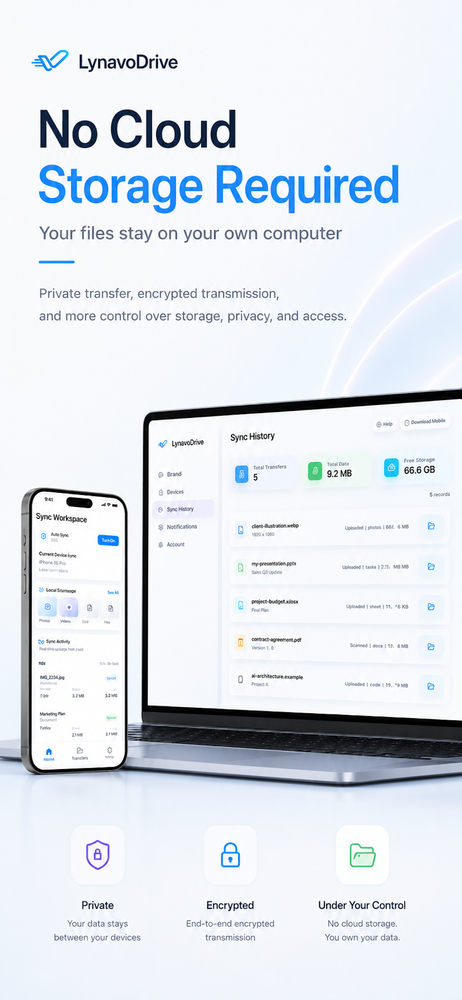
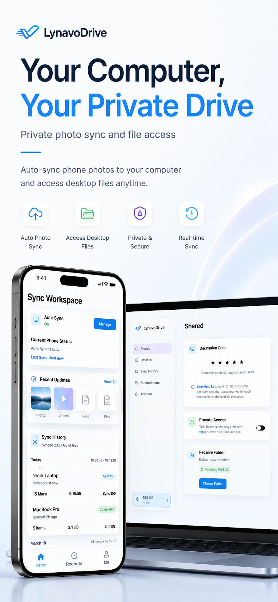

<p align="center">
  <a href="./README.md">English</a> | <strong>繁體中文</strong>
</p>

<p align="center">
  
</p>

<p align="center">
  
</p>

<h1 align="center">Lynavo Drive</h1>

<p align="center">
  <strong>一款高效能、從行動端（iOS / Android）至桌面端（macOS / Windows）的區域網路 (LAN) 增量同步媒體工具。</strong>
</p>

<p align="center">
  
  
  
  
  
</p>

<p align="center">
  <a href="#-螢幕截圖預覽">螢幕截圖</a> •
  <a href="#-開源邊界">開源邊界</a> •
  <a href="#-快速開始">快速開始</a> •
  <a href="#-技術棧">技術棧</a>
</p>

---

## 目前狀態

- 桌面端、Go 側車服務 (Sidecar)、行動端以及原生 iOS / Android 同步功能皆已實作完成。
- iOS 和 Android 行動端應用程式皆在專案範圍內。
- 目前的工作重點為錯誤復原、收緊開源邊界以及本地建置 / 套件驗證。
- 本儲存庫目前沒有獨立維護的產品規格書；開發基準線為目前的程式碼、`@lynavo-drive/contracts` 和測試矩陣。
- 訪客 / 本地使用者可以使用前台區域網路 (LAN) 自動同步。遠端存取與後台靜默持續同步不屬於開源執行階段的一部分，在沒有官方特性的情況下預設保持關閉。

## 📸 螢幕截圖預覽

<table width="100%">
  <tr>
    <td width="33%" align="center">
      <strong>1. 設備發現</strong><br>
      <br>
      <sub>透過 mDNS 進行區域網路 (LAN) 配對</sub>
    </td>
    <td width="33%" align="center">
      <strong>2. 行動端媒體掃描</strong><br>
      <br>
      <sub>照片庫的增量掃描器</sub>
    </td>
    <td width="33%" align="center">
      <strong>3. 作用中的同步佇列</strong><br>
      <br>
      <sub>單一檔案序列上傳追蹤</sub>
    </td>
  </tr>
  <tr>
    <td width="33%" align="center">
      <strong>4. 同步歷史紀錄</strong><br>
      <br>
      <sub>傳輸日誌與每日完成統計</sub>
    </td>
    <td width="33%" align="center">
      <strong>5. 桌面端設定</strong><br>
      <br>
      <sub>共用目標目錄設定</sub>
    </td>
    <td width="33%" align="center">
      <!-- 保持網格佈局平衡的空單元格 -->
    </td>
  </tr>
</table>

## 🛡️ 開源邊界

<a id="-key-features"></a>
<a id="-oss-boundaries"></a>

> [!IMPORTANT]
> **開源核心與同步限制**
>
> - **訪客區域網路 (LAN) 模式**：前台自動同步無需登入或帳戶服務狀態即可直接使用。設備會自動進行發現、配對、掃描待處理佇列並透過區域網路 (LAN) 進行上傳。
> - **嚴格唯讀的佇列**：使用者無法在使用者介面 (UI) 中刪除、重新排序或跳過佇列項目。
> - **僅限自動增量同步**：不提供手動檔案選取備用方案或核取方塊挑選功能。同步完全由本地掃描和待處理佇列驅動。
> - **故障開啟 (Fail-open) / 寬鬆放行的區域網路 (LAN) 同步**：前台區域網路 (LAN) 同步絕不會被登入、帳戶服務狀態或缺失的非開源模組所阻斷。
> - **單一設備序列上傳**：指定的行動端用戶端一次只能向桌面端上傳一個檔案。

> [!WARNING]
> **預設關閉功能與授權**
>
> - **非開源功能故障關閉 (Fail-closed) / 嚴格阻斷**：後台靜默繼續、遠端存取與通道憑證需要官方特性，且預設會故障關閉 (Fail-closed) / 嚴格阻斷（保持停用）。
> - **不重新分發 Apple Bonjour**：開源建置版本不重新分發適用於 Windows 的 Apple Bonjour 二進位檔案。Windows 使用者必須使用其本地的 Bonjour 安裝，或預設使用相容於 zeroconf 的備用方案。
> - **單一基準線**：在此基準線中，不提供多市場分支、專用帳戶路徑或雙市場迴歸測試矩陣。

> [!NOTE]
> **未來的遷移邊界**
> 套件範圍（Package scope）、mDNS 服務名稱、舊版數據目錄以及原生套件 / 軟體包識別碼（bundle ID）重新命名皆為遷移邊界，在此次文件處理中無需進行重新命名。

## 🚀 快速開始

```bash
# 1. 安裝依賴項目
pnpm install

# 2. 建置共用套件
pnpm --filter @lynavo-drive/contracts build
pnpm --filter @lynavo-drive/design-tokens build

# 3. 啟動桌面端開發模式
pnpm dev:desktop
```

Electron 視窗會自動開啟，桌面端應用程式會啟動側車服務 (Sidecar)。

## ❓ 常見問題與疑難排解

<details>
<summary>🔍 檢視疑難排解指南與常見問題</summary>

### 1. 行動端應用程式找不到我的桌面端用戶端 (mDNS 設備發現失敗)

- **檢查網路**：確保行動端和桌面端皆處於同一個區域網路 (LAN)（或 VPN-LAN）。
- **Windows 防火牆**：驗證 Windows Defender 防火牆是否允許連接埠 `39393` (TCP/LMUP 檔案傳輸) 和 `39394` (HTTP API) 的連入流量。
- **Bonjour 執行階段**：開源建置版本不重新分發 Apple Bonjour。請確保 Windows 上已安裝 Bonjour，或依賴相容於 zeroconf 的備用方案。

### 2. 為什麼我的一些 iCloud 照片卡住 / 無法傳輸？

- 標記為 `iCloud` 的照片在傳輸前，必須先從 Apple Photos 雲端儲存庫中匯出。
- 在 `cloud_downloading` 或 `preparing` 狀態下，手機正在將高解析度的原始資產下載至本地儲存空間。下載完成後會自動開始傳輸。

### 3. 我可以手動選擇要同步哪些照片 / 影片嗎？

- 不行。為確保完全自動的增量同步，Lynavo Drive 完全依賴行動端後台 / 前台掃描以及嚴格唯讀的待處理佇列。在此基準線中，核取方塊挑選並非本專案的目標。

### 4. 當桌面端進入睡眠狀態或連線中斷時會發生什麼事？

- 區域網路 (LAN) 傳輸將會中斷。一旦桌面端喚醒並恢復網路連線，行動端應用程式將自動繼續執行未完成的佇列，而不會遺失進度。
- 在桌面端應用程式設定中啟用「同步時防止電腦進入睡眠」，以確保傳輸不中斷。

</details>

## 🛠️ 技術棧

| 層級               | 技術                                                       |
| ------------------ | ---------------------------------------------------------- |
| Monorepo           | pnpm 10 + turborepo 2.8                                    |
| 桌面端             | Electron 41 + electron-vite 5 + electron-builder 26        |
| 桌面端 UI          | React 18.3 + zustand 5 + Tailwind CSS v4                   |
| 行動端             | React Native 0.84.1 + React 19 (iOS / Android)             |
| iOS 原生           | Swift `SyncEngine` + BGTask + PhotoKit + Network.framework |
| Android 原生       | Kotlin 橋接 + NativeSyncEngine / MediaStore / NsdManager   |
| 側車服務 (Sidecar) | Go 1.25.6 + SQLite + WebSocket                             |
| 共用套件           | `@lynavo-drive/contracts` + `@lynavo-drive/design-tokens`  |
| 測試               | vitest 4.1 + jest + `go test`                              |

## 🏗️ 架構概覽

```text
Mobile (RN UI on iOS / Android)
  ├── iOS: Swift SyncEngine
  └── Android: Kotlin NativeSyncEngine
  ├── Bonjour/mDNS discover
  ├── LMUP/TCP :39393
  └── Presence/HTTP :39394
                │
                ▼
Desktop (Electron + Go sidecar, macOS / Windows)
  ├── Electron: UI shell, window, bridge, sidecar lifecycle
  ├── Sidecar HTTP API / WebSocket
  ├── LMUP file receiver
  ├── SQLite
  └── Filesystem / shared directory detection
```

## ⚙️ 系統需求

- **macOS 或 Windows**（桌面端目前支援 macOS / Windows；Linux 僅用於本地建置 / 套件驗證；iOS 建置仍需要 macOS + Xcode）
- **Node.js** >= 22.12.0
- **pnpm** >= 10
- **Go** >= 1.25.6 (側車服務 (Sidecar) 開發與測試)

<details>
<summary>📱 檢視行動端與平台特定 SDK 需求</summary>

- **Xcode + CocoaPods**（iOS 建置和設備偵錯，僅限 macOS）
- **Android Studio + Android SDK / NDK**（Android 建置和偵錯）

</details>

## 💻 常用指令

<details>
<summary>🛠️ 檢視開發者指令參考</summary>

```bash
# Desktop
pnpm dev:desktop
pnpm build:desktop
pnpm package:desktop          # macOS local DMG
pnpm package:desktop:win      # Windows NSIS + zip (default desktop Windows package, no release profile)

# Mobile
pnpm dev:mobile
pnpm build:mobile
pnpm dev:mobile:android
pnpm build:mobile:android  # Android Debug build (assembleDebug)

# Sidecar
pnpm dev:sidecar
pnpm build:sidecar
pnpm test:sidecar

# Full repository validation
pnpm build
pnpm test
pnpm typecheck
pnpm format:check
pnpm check
```

</details>

## 📦 開源版本建置與套件驗證

此開源儲存庫保留了本地源碼建置和套件驗證路徑。

<details>
<summary>🔬 檢視驗證與建置管道</summary>

```bash
# Inspect the local build / package commands that would run
pnpm release --profile review --targets ios,android,mac,win,linux --dry-run

# Local iOS / Android Debug / Desktop build verification
pnpm build:mobile
pnpm build:mobile:ios:release
pnpm build:mobile:android
pnpm package:desktop

# Android Release source-build verification
pnpm release --profile review --targets android --dry-run
pnpm release --profile review --targets android

# Local desktop platform package
pnpm package:desktop

# Linux package verification (Linux host, one arch per run)
pnpm --filter @lynavo-drive/desktop package:linux -- --arch=x64
pnpm --filter @lynavo-drive/desktop package:linux -- --arch=arm64
```

</details>

`release` 配置僅注入 `LYNAVO_RELEASE_CHANNEL` 與本地建置設定，且僅選擇本地建置 / 套件指令。

## 📁 專案結構

<details>
<summary>📂 檢視目錄結構圖</summary>

```text
lynavo-drive/
├── apps/
│   ├── desktop/              # Electron desktop app
│   │   └── src/
│   │       ├── main/         # Main process (window, IPC, sidecar lifecycle)
│   │       ├── preload/      # Preload bridge
│   │       └── renderer/     # React 18 UI
│   └── mobile/               # React Native iOS/Android app + native sync
│       ├── ios/              # Xcode project and Swift native modules
│       ├── android/          # Android project, Kotlin bridge, native sync
│       ├── src/              # RN screens and hooks
│       └── __tests__/        # RN tests
├── packages/
│   ├── contracts/            # Shared DTOs / constants / events / error codes
│   └── design-tokens/        # Shared design tokens
├── services/
│   └── sidecar-go/           # Go sidecar (TCP/HTTP/SQLite/mDNS)
└── docs/
    ├── architecture/         # Architecture, state machine, data model
    ├── operations/           # Troubleshooting, diagnostics, sidecar runbook
    ├── product/              # Product constraints, OSS boundaries, non-goals
    ├── release/              # OSS build and package verification playbook
    └── testing/              # OSS verification matrix
```

</details>

## 🎯 開發基準線

- 共用型別、常數、事件名稱和連接埠定義皆來自於 `@lynavo-drive/contracts`。
- 渲染器 (Renderer) 不直接存取側車服務 (Sidecar)、檔案系統或 SQLite；所有存取皆透過預載橋接 (preload bridge) / 主程序 (main process) 進行。
- 佇列保持唯讀狀態。使用者介面 (UI) 無法刪除、重新排序或跳過項目。
- 指定的手機一次只能上傳一個檔案。
- 訪客 / 本地前台區域網路 (LAN) 同步為故障開啟 (Fail-open) / 寬鬆放行；遠端存取和後台持續運作則為故障關閉 (Fail-closed) / 嚴格阻斷。

## 📄 文件參考

- 開發限制與營運規則：[`AGENTS.md`](./AGENTS.md)
- 系統概覽：[`docs/architecture/system-overview.md`](./docs/architecture/system-overview.md)
- 同步狀態機：[`docs/architecture/sync-state-machine.md`](./docs/architecture/sync-state-machine.md)
- 資料模型與統計語義：[`docs/architecture/data-model.md`](./docs/architecture/data-model.md)
- 疑難排解指南：[`docs/operations/troubleshooting.md`](./docs/operations/troubleshooting.md)
- 行動端診斷套件：[`docs/operations/mobile-diagnostics.md`](./docs/operations/mobile-diagnostics.md)
- 側車服務 (Sidecar) 運作手冊：[`docs/operations/sidecar-runbook.md`](./docs/operations/sidecar-runbook.md)
- 產品限制、開源邊界與非目標：[`docs/product/constraints.md`](./docs/product/constraints.md)
- 開源版本建置驗證手冊：[`docs/release/release-playbook.md`](./docs/release/release-playbook.md)
- 開源驗證矩陣：[`docs/testing/oss-verification-matrix.md`](./docs/testing/oss-verification-matrix.md)
- 安全性政策：[`SECURITY.md`](./SECURITY.md)
- 隱私權聲明：[`PRIVACY.md`](./PRIVACY.md)
- 貢獻指南：[`CONTRIBUTING.md`](./CONTRIBUTING.md)
- 行為準則：[`CODE_OF_CONDUCT.md`](./CODE_OF_CONDUCT.md)
- 第三方聲明：[`THIRD_PARTY_NOTICES.md`](./THIRD_PARTY_NOTICES.md)

## 💡 參與貢獻

我們非常歡迎來自社群的貢獻！若要開始參與：

1. **Fork 本儲存庫**：建立個人 Fork 並將其複製到本地。
2. **設定開發工作區**：安裝依賴項目並編譯共用套件：
   ```bash
   pnpm install
   pnpm build
   ```
3. **驗證測試**：在提交 PR 之前，確保所有格式化、TypeScript 檢查和單元測試皆已通過：
   ```bash
   pnpm test
   pnpm typecheck
   pnpm format:check
   ```

若要深入瞭解詳細的撰寫規範、專案配置和程序規則，請參閱我們的[貢獻指南](./CONTRIBUTING.md)與[行為準則](./CODE_OF_CONDUCT.md)。

## ⚖️ 授權條款

MIT。請參閱 [`LICENSE`](./LICENSE)。
