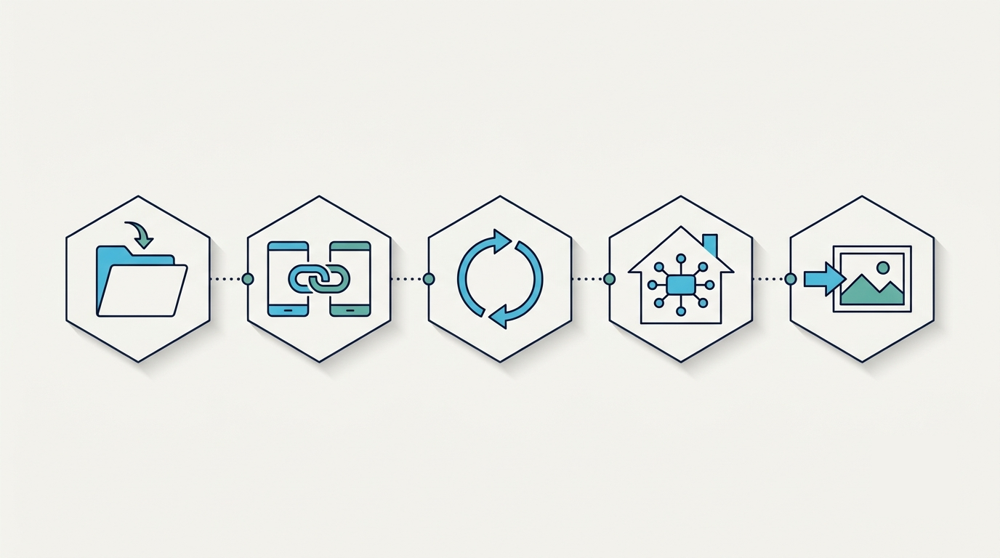

# First Automatic Backup: Setup And Verification

This guide turns the first phone-to-desktop photo backup into observable
checkpoints. It describes the public OSS local-LAN baseline in this repository.
For signed end-user installers and the current official-edition capabilities,
use the [official download page](https://drive.lynavo.io/download.html).

## 1. Prepare The Desktop Destination

Start the desktop application before configuring the phone.

1. Open the desktop application.
2. Confirm the receive directory and available storage.
3. Keep the desktop awake and the sidecar running.
4. Note the QR code or six-digit pairing code shown by the desktop.

The computer is the destination. Preparing it first makes a failed setup easier
to classify as a destination, discovery, pairing, queue, or transport issue.

## 2. Pair The Mobile Device

Keep the phone and computer on the same LAN.

1. Open the mobile application.
2. Select the discovered desktop, or use the documented manual LAN fallback.
3. Scan the QR code or enter the six-digit pairing code.
4. Confirm that the selected desktop becomes reachable.

The desktop identifies a phone by its stored `clientId`, not by device name or
IP address. Do not publish pairing codes, local addresses, device names, or
diagnostic files without redaction.

## 3. Enable Automatic Upload

Automatic upload is a separate user choice. Turn it on after pairing.

The OSS baseline scans the mobile photo library and builds the upload set from
the read-only local pending queue. It does not provide manual photo picking,
queue reordering, skipping, or deletion controls. A phone uploads one file at a
time.

Keep the mobile app in the foreground for the first OSS verification run. The
public OSS baseline does not provide silent background continuation, remote
relay, or tunnel credentials. Those paths remain disabled when official
capability is unavailable.

## 4. Verify One New Photo

Use one recognizable, non-sensitive test photo before testing a large library.

1. Create one new photo on the phone.
2. Wait for it to enter the pending queue and begin uploading.
3. Confirm that it appears in the desktop receive directory.
4. Open the destination file on the computer.
5. Confirm that the queue continues with the next pending item, if one exists.

The first passing event is a completed desktop write, not a progress indicator
on the phone. The completion day used by history and dashboard statistics is
the desktop sidecar's local completion day.

## 5. Interpret Failures By Checkpoint

| Checkpoint               | First checks                                                   |
| ------------------------ | -------------------------------------------------------------- |
| Destination ready        | Receive directory, available storage, sidecar health           |
| Desktop discovered       | Same LAN, mDNS/Bonjour or fallback, ports `39593` and `39594`  |
| Pairing complete         | Current pairing code, stored binding, desktop reachability     |
| Automatic upload enabled | Photo permission, scan result, pending queue                   |
| First file received      | `SYNC_BEGIN`, `FILE_INIT_REQ`, ACK/reconnect, destination file |

Short transport interruptions can enter reconnect and resume. Treat a flow that
recovers within seconds as reconnecting rather than final failure. See the
[troubleshooting guide](./troubleshooting.md) for the layered diagnosis paths
and log keywords.

## Product Boundaries

- This repository covers foreground automatic sync over the same LAN.
- The upload set comes from the automatic scan and read-only pending queue.
- Each phone uploads a single file at a time.
- Phone and desktop file deletion are independent; this is not full two-way
  folder synchronization.
- The OSS baseline does not include official accounts, remote access, relay,
  tunnel credentials, silent background continuation, signed installers, or
  store distribution.
- Official and commercial builds may expose capabilities that are intentionally
  outside this repository. Verify those capabilities and plan rules on the
  official site instead of inferring them from the OSS source.

A successful computer copy is a useful first backup step, but important media
still needs another copy on separate storage or in another location.
